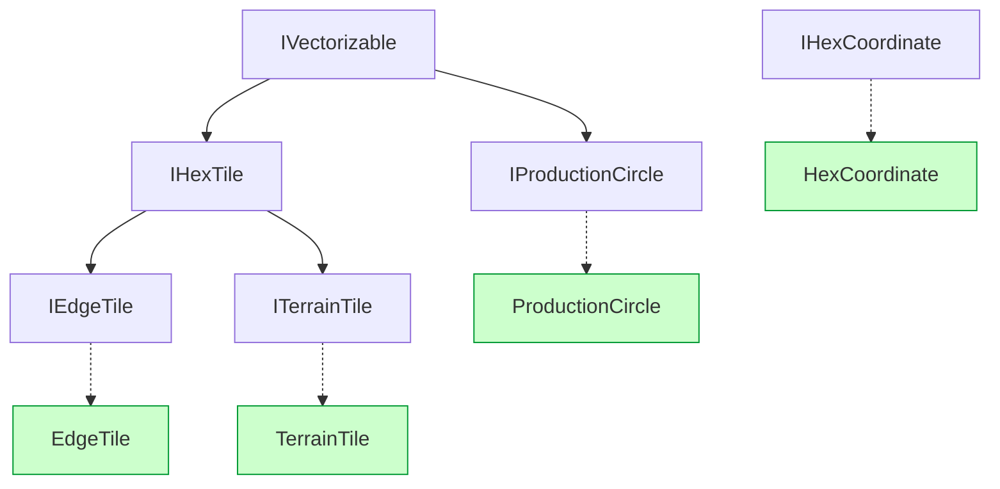

# catan-engine

```mermaid
flowchart TD
    IVectorizable --> IProductionCircle
    
    IVectorizable --> IHexTile
    
    IHexTile --> IEdgeTile
    IEdgeTile -.-> EdgeTile

    IHexTile --> ITerrainTile
    ITerrainTile -.-> TerrainTile
   
    IHexCoordinate -.-> HexCoordinate
    
    IProductionCircle -.-> ProductionCircle
    
    style ProductionCircle fill:#ccffcc, stroke:#009933
    style EdgeTile fill:#ccffcc, stroke:#009933
    style TerrainTile fill:#ccffcc, stroke:#009933
    style HexCoordinate fill:#ccffcc, stroke:#009933

```
