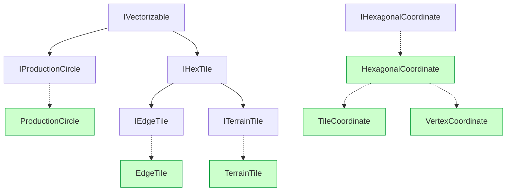

# catan-engine

```mermaid
flowchart TD
    IVectorizable --> IProductionCircle
    
    IVectorizable --> IHexTile
    
    IHexTile --> IEdgeTile
    IEdgeTile -.-> EdgeTile

    IHexTile --> ITerrainTile
    ITerrainTile -.-> TerrainTile
       
    IHexagonalCoordinate -.-> HexagonalCoordinate
    HexagonalCoordinate -.-> TileCoordinate
    HexagonalCoordinate -.-> VertexCoordinate

    IProductionCircle -.-> ProductionCircle
    
    style ProductionCircle fill:#ccffcc, stroke:#009933
    style EdgeTile fill:#ccffcc, stroke:#009933
    style TerrainTile fill:#ccffcc, stroke:#009933
    style HexagonalCoordinate fill:#ccffcc, stroke:#009933
    style TileCoordinate fill:#ccffcc, stroke:#009933
    style VertexCoordinate fill:#ccffcc, stroke:#009933

```
